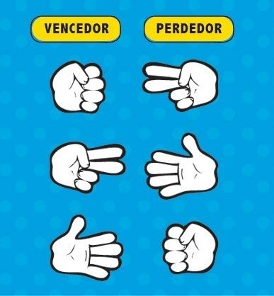

# Pedra, Papel, Tesoura

Pedra, Papel, Tesoura é um jogo clássico e rápido. Para jogar, cada participante escolhe entre três opções: pedra, papel ou tesoura.

- **Pedra quebra Tesoura:** Se você escolher pedra e seu oponente escolher tesoura, você vence.
- **Tesoura corta Papel:** Se você escolher tesoura e seu oponente escolher papel, você vence.
- **Papel cobre Pedra:** Se você escolher papel e seu oponente escolher pedra, você vence.
- Se os dois participantes escolherem a mesma opção, o jogo empata.

## Tarefas

No nosso jogo, faremos jogador vs. computador.

1. Precisamos começar gerando a jogada do computador:
   - Pesquise sobre o módulo `random` do Python e como importá-lo no arquivo `pedra_papel_tesoura.py` (veja linha 2).
   - Procure por um comando que gere um número inteiro aleatório dentro do intervalo de 0 a 2 e atribua o resultado dele na variável `opcao_computador` (veja linha 15).
   - Na linha 18, use uma estrutura condicional em que:
     - caso a variável `opcao_computador` seja 0, atribua o texto 'pedra' a ela;
     - caso a variável `opcao_computador` seja 1, atribua o texto 'papel' a ela;
     - caso a variável `opcao_computador` seja 2, atribua o texto 'tesoura' a ela
2. Para cada mudança que você fizer no código, tente jogar no navegador. Considere que, o que o jogador selecionar, ficará armazenado na forma textual na variável `opcao_jogador`. Vamos à lógica do jogo:
   - Exiba o valor da variável `opcao_jogador` e veja-a no terminal (linha 20). 
   - Use uma estrutura condicional para as variáveis `opcao_computador` e `opcao_jogador` para descrobrir quem venceu (linha 22):
     - Pense em todas as combinações em que o jogador vence o computador e coloque-as como condição de um único `if`. Use operadores lógicos. Dentro do bloco do `if`, atribua 'Jogador venceu!' à variável mensagem.
     - No else, atribua 'Computador venceu!' à variável mensagem.
   - Crie uma nova estrutura condicional que verifique se `opcao_computador` e `opcao_jogador`. Se for o caso, atribua 'Empate!' à variável mensagem (linha 24).